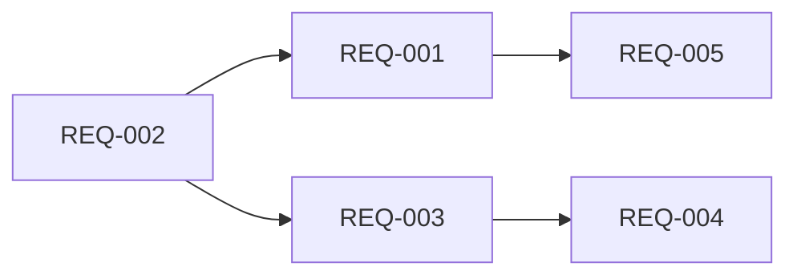

# Spec: Wire TLS Support in mORMot-MCP-Server

<!-- METADATA
version: "4.0"
created: 2026-02-20
quality: ALTA
reqs: 5
has_context: true
adversarial_review: true
-->

## Objetivo

Enable HTTPS for the mORMot-MCP-Server so it can serve MCP over TLS — required for production deployments, Cloudflare tunnels with TLS termination, and secure remote connections from Claude Code.

## Contexto Técnico

| Aspecto | Detalle |
|---------|---------|
| Archivos principales | `MCP.Transport.Http.pas`, `MCP.Types.pas`, `MCP.Transport.Base.pas`, `MCPServer.dpr` |
| Patrón a seguir | mORMot2's `hsoEnableTls` + `WaitStarted(secs, certFile, keyFile, password)` — documented in `mormot.net.server.pas:1156-1162` |
| Riesgos | OpenSSL DLLs must be present at runtime when using `--tls`; SChannel fallback on Windows has limited cipher support |

### Existing infrastructure (already wired, just unused)

- `TMCPServerSettings.SSLEnabled`, `.SSLCertFile`, `.SSLKeyFile` in `MCP.Types.pas:109-114`
- `TMCPTransportConfig.SSLEnabled`, `.SSLCertFile`, `.SSLKeyFile` in `MCP.Transport.Base.pas:41-43`
- `ConfigFromSettings` already copies SSL fields (`MCP.Transport.Base.pas:427-429`)

### mORMot2 TLS API (from source)

```pascal
// Option flag:
hsoEnableTls  // in THttpServerOptions (mormot.net.server.pas:488)

// WaitStarted overload with cert params:
procedure WaitStarted(Seconds: integer; const CertificateFile: TFileName;
  const PrivateKeyFile: TFileName = ''; const PrivateKeyPassword: RawUtf8 = '';
  const CACertificatesFile: TFileName = '');  // mormot.net.server.pas:1161

// Self-signed convenience:
procedure WaitStartedHttps(Seconds: integer = 30;
  UsePreComputed: boolean = true);  // mormot.net.server.pas:1174
```

## Requisitos

### REQ-001: Wire TLS to THttpAsyncServer creation `MUST`

When `SSLEnabled=true` in config, pass `hsoEnableTls` in `THttpServerOptions` and call the `WaitStarted` overload with cert/key paths.

**Criterio de aceptación:**
- [ ] `MCPServer.exe --transport=http --tls --cert=server.crt --key=server.key` starts HTTPS server
- [ ] `curl -k https://localhost:3000/mcp` returns server info JSON
- [ ] `MCPServer.exe --transport=http` (no TLS flags) starts plain HTTP as before — no regression

### REQ-002: Add SSLKeyPassword and SSLSelfSigned to config records `MUST`

Add `SSLKeyPassword: RawUtf8` and `SSLSelfSigned: Boolean` to both `TMCPServerSettings` and `TMCPTransportConfig`. Initialize to empty/false in defaults. Propagate in `ConfigFromSettings`.

**Criterio de aceptación:**
- [ ] `TMCPServerSettings` has `SSLKeyPassword` and `SSLSelfSigned` fields
- [ ] `TMCPTransportConfig` has `SSLKeyPassword` and `SSLSelfSigned` fields
- [ ] `InitDefaultSettings` initializes both to empty/false
- [ ] `InitDefaultTransportConfig` initializes both to empty/false
- [ ] `ConfigFromSettings` copies both fields

### REQ-003: CLI switches for TLS `MUST`

Add command-line parsing: `--tls`, `--cert=path`, `--key=path`, `--key-password=pass`, `--tls-self-signed`.

**Criterio de aceptación:**
- [ ] `--tls` sets `SSLEnabled := True`
- [ ] `--cert=server.crt` sets `SSLCertFile`
- [ ] `--key=server.key` sets `SSLKeyFile`
- [ ] `--key-password=pass` sets `SSLKeyPassword`
- [ ] `--tls-self-signed` sets `SSLSelfSigned := True` (implies `SSLEnabled`)

### REQ-004: Self-signed TLS for development `SHOULD`

When `--tls-self-signed` is used, call `WaitStartedHttps()` instead of `WaitStarted(cert, key)`. This uses mORMot2's built-in self-signed cert generation.

**Criterio de aceptación:**
- [ ] `MCPServer.exe --transport=http --tls-self-signed` starts HTTPS with auto-generated cert
- [ ] No cert/key files needed on disk
- [ ] Console output shows `https://` URL

### REQ-005: Console output reflects TLS state `SHOULD`

Log messages and console output show `https://` when TLS is active, `http://` when not.

**Criterio de aceptación:**
- [ ] With `--tls`: console shows `Server listening on https://0.0.0.0:3000/mcp`
- [ ] Without `--tls`: console shows `Server listening on http://0.0.0.0:3000/mcp`
- [ ] TSynLog entry reflects the protocol used

## Dependencias



## Decisiones de Diseño

| Decisión | Justificación |
|----------|---------------|
| Don't add `mormot.crypt.openssl` to uses | Let the user/deployer decide TLS backend. SChannel works on Windows without OpenSSL DLLs. Document in README that OpenSSL is recommended for modern ciphers. |
| No mutual TLS (client certs) | Not needed for MCP protocol. Can be added later via `TNetTlsContext.ClientCertificateAuthentication`. |
| `--tls-self-signed` as convenience | Lowers barrier for dev/testing. Production should use real certs. |
| `WaitStarted(30, cert, key, password)` with 30s timeout | Consistent with mORMot2 defaults. Long enough for cert loading on slow disk. |

## Restricciones

- ❌ Do NOT change the default behavior (no flags = plain HTTP)
- ❌ Do NOT force OpenSSL dependency — keep it optional
- ❌ Do NOT modify `MCP.Transport.Stdio.pas` (TLS is irrelevant for stdio)

## Fuera de Alcance

- Mutual TLS / client certificate authentication
- Certificate auto-renewal (Let's Encrypt ACME)
- Wiring TLS in mORMot-MCP-Bridge (separate project)
- settings.ini file parsing for TLS config (could be added later)
